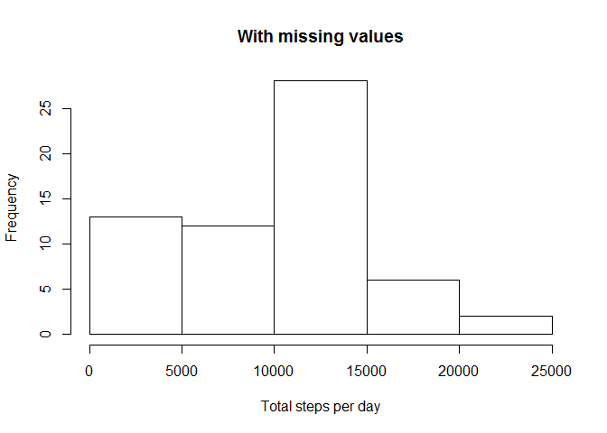
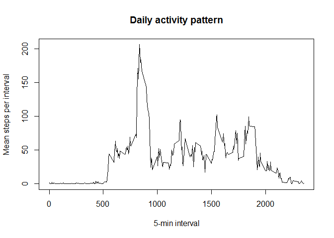
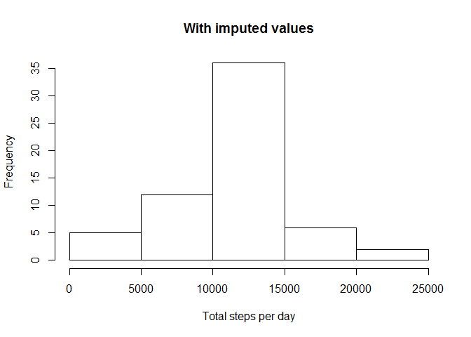
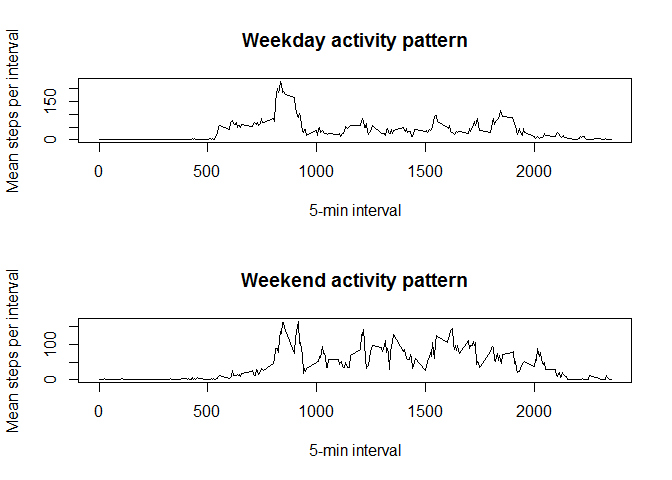

# Reproducible Research: Peer Assessment 1


### Loading and preprocessing the data

1. Load the data (i.e. `read.csv()`)


```r
activity<-read.csv("activity.csv")
#str(activity)
head(activity)
```

```
##   steps       date interval
## 1    NA 2012-10-01        0
## 2    NA 2012-10-01        5
## 3    NA 2012-10-01       10
## 4    NA 2012-10-01       15
## 5    NA 2012-10-01       20
## 6    NA 2012-10-01       25
```

2. Process/transform the data (if necessary) into a format suitable for your analysis


```r
activity$date<-as.Date(activity$date)
#str(activity)
```

### What is mean total number of steps taken per day?

For this part of the assignment, you can ignore the missing values in
the dataset.

1. Make a histogram of the total number of steps taken each day


```r
totalStepsDay<-with(activity, tapply(steps, date, sum, na.rm=TRUE))
#activity[activity$date=="2012-10-01",]

hist(totalStepsDay, xlab="Total steps per day", main="With missing values")
```

 

2. Calculate and report the **mean** and **median** total number of steps taken per day


```r
summary(totalStepsDay)
```

```
##    Min. 1st Qu.  Median    Mean 3rd Qu.    Max. 
##       0    6778   10400    9354   12810   21190
```

```r
# mean=9354 steps
# median=10400 steps
```

### What is the average daily activity pattern?

1. Make a time series plot (i.e. `type = "l"`) of the 5-minute interval (x-axis) and the average number of steps taken, averaged across all days (y-axis)


```r
meanStepsInterval<-with(activity, tapply(steps, interval, mean, na.rm=TRUE))

plot(rownames(meanStepsInterval), meanStepsInterval, type='l', xlab="5-min interval", ylab="Mean steps per interval", main="Daily activity pattern")
```

 

2. Which 5-minute interval, on average across all the days in the dataset, contains the maximum number of steps?


```r
meanStepsInterval[max(meanStepsInterval)]
```

```
##     1705 
## 56.30189
```

```r
# interval=1705
```

### Imputing missing values

Note that there are a number of days/intervals where there are missing
values (coded as `NA`). The presence of missing days may introduce
bias into some calculations or summaries of the data.

1. Calculate and report the total number of missing values in the dataset (i.e. the total number of rows with `NA`s)


```r
summary(activity)
```

```
##      steps             date               interval     
##  Min.   :  0.00   Min.   :2012-10-01   Min.   :   0.0  
##  1st Qu.:  0.00   1st Qu.:2012-10-16   1st Qu.: 588.8  
##  Median :  0.00   Median :2012-10-31   Median :1177.5  
##  Mean   : 37.38   Mean   :2012-10-31   Mean   :1177.5  
##  3rd Qu.: 12.00   3rd Qu.:2012-11-15   3rd Qu.:1766.2  
##  Max.   :806.00   Max.   :2012-11-30   Max.   :2355.0  
##  NA's   :2304
```

```r
sum(is.na(activity$steps))
```

```
## [1] 2304
```

```r
# 2304
```

2. Devise a strategy for filling in all of the missing values in the dataset. The strategy does not need to be sophisticated. For example, you could use the mean/median for that day, or the mean for that 5-minute interval, etc.


```r
meanStepsInterval<-with(activity, tapply(steps, interval, mean, na.rm=TRUE))

activityImputation<-data.frame(meanStepsInterval, interval=as.numeric(rownames(meanStepsInterval)))

head(activityImputation)
```

```
##    meanStepsInterval interval
## 0          1.7169811        0
## 5          0.3396226        5
## 10         0.1320755       10
## 15         0.1509434       15
## 20         0.0754717       20
## 25         2.0943396       25
```

```r
#str(activityImputation)
```

3. Create a new dataset that is equal to the original dataset but with the missing data filled in.


```r
# split dataframe by whether there is missing step data
activitySplit<-split(activity, is.na(activity$steps)==1)
#str(activitySplit)

activityNA0<-activitySplit[[1]]
#str(activityNA0)

activityNA1<-activitySplit[[2]]
#str(activityNA1)

# merge imputed values with missing values
head(activityImputation)
```

```
##    meanStepsInterval interval
## 0          1.7169811        0
## 5          0.3396226        5
## 10         0.1320755       10
## 15         0.1509434       15
## 20         0.0754717       20
## 25         2.0943396       25
```

```r
head(activityNA1)
```

```
##   steps       date interval
## 1    NA 2012-10-01        0
## 2    NA 2012-10-01        5
## 3    NA 2012-10-01       10
## 4    NA 2012-10-01       15
## 5    NA 2012-10-01       20
## 6    NA 2012-10-01       25
```

```r
activityImputed<-merge(activityImputation, activityNA1)
head(activityImputed)
```

```
##   interval meanStepsInterval steps       date
## 1        0          1.716981    NA 2012-10-01
## 2        0          1.716981    NA 2012-11-30
## 3        0          1.716981    NA 2012-11-04
## 4        0          1.716981    NA 2012-11-09
## 5        0          1.716981    NA 2012-11-14
## 6        0          1.716981    NA 2012-11-10
```

```r
# create clean dataframe
activityImputed2<-data.frame(steps=activityImputed$meanStepsInterval, date=activityImputed$date, interval=activityImputed$interval)
head(activityImputed2)
```

```
##      steps       date interval
## 1 1.716981 2012-10-01        0
## 2 1.716981 2012-11-30        0
## 3 1.716981 2012-11-04        0
## 4 1.716981 2012-11-09        0
## 5 1.716981 2012-11-14        0
## 6 1.716981 2012-11-10        0
```

```r
# combine imputed with non-missing data
activity2<-rbind(activityNA0, activityImputed2)

#str(activity)
#str(activity2)

summary(activity)
```

```
##      steps             date               interval     
##  Min.   :  0.00   Min.   :2012-10-01   Min.   :   0.0  
##  1st Qu.:  0.00   1st Qu.:2012-10-16   1st Qu.: 588.8  
##  Median :  0.00   Median :2012-10-31   Median :1177.5  
##  Mean   : 37.38   Mean   :2012-10-31   Mean   :1177.5  
##  3rd Qu.: 12.00   3rd Qu.:2012-11-15   3rd Qu.:1766.2  
##  Max.   :806.00   Max.   :2012-11-30   Max.   :2355.0  
##  NA's   :2304
```

```r
summary(activity2)
```

```
##      steps             date               interval     
##  Min.   :  0.00   Min.   :2012-10-01   Min.   :   0.0  
##  1st Qu.:  0.00   1st Qu.:2012-10-16   1st Qu.: 588.8  
##  Median :  0.00   Median :2012-10-31   Median :1177.5  
##  Mean   : 37.38   Mean   :2012-10-31   Mean   :1177.5  
##  3rd Qu.: 27.00   3rd Qu.:2012-11-15   3rd Qu.:1766.2  
##  Max.   :806.00   Max.   :2012-11-30   Max.   :2355.0
```

```r
# reorder
activity2<-activity2[order(activity2$date, activity2$interval),]
head(activity2)
```

```
##            steps       date interval
## 152651 1.7169811 2012-10-01        0
## 152741 0.3396226 2012-10-01        5
## 152811 0.1320755 2012-10-01       10
## 152931 0.1509434 2012-10-01       15
## 152971 0.0754717 2012-10-01       20
## 153091 2.0943396 2012-10-01       25
```

```r
tail(activity2)
```

```
##           steps       date interval
## 17524 2.6037736 2012-11-30     2330
## 17536 4.6981132 2012-11-30     2335
## 17540 3.3018868 2012-11-30     2340
## 17552 0.6415094 2012-11-30     2345
## 17559 0.2264151 2012-11-30     2350
## 17568 1.0754717 2012-11-30     2355
```

4. Make a histogram of the total number of steps taken each day and Calculate and report the **mean** and **median** total number of steps taken per day. Do these values differ from the estimates from the first part of the assignment? What is the impact of imputing missing data on the estimates of the total daily number of steps?


```r
totalStepsDay2<-with(activity2, tapply(steps, date, sum, na.rm=TRUE))

hist(totalStepsDay2, xlab="Total steps per day", main="With imputed values")
```

 

```r
summary(totalStepsDay2)
```

```
##    Min. 1st Qu.  Median    Mean 3rd Qu.    Max. 
##      41    9819   10770   10770   12810   21190
```

```r
# mean=10770 steps
# median=10770 steps
```

### Are there differences in activity patterns between weekdays and weekends?

For this part the `weekdays()` function may be of some help here. Use
the dataset with the filled-in missing values for this part.

1. Create a new factor variable in the dataset with two levels -- "weekday" and "weekend" indicating whether a given date is a weekday or weekend day.


```r
activity2$dayName<-weekdays(activity2$date)
head(activity2)
```

```
##            steps       date interval dayName
## 152651 1.7169811 2012-10-01        0  Monday
## 152741 0.3396226 2012-10-01        5  Monday
## 152811 0.1320755 2012-10-01       10  Monday
## 152931 0.1509434 2012-10-01       15  Monday
## 152971 0.0754717 2012-10-01       20  Monday
## 153091 2.0943396 2012-10-01       25  Monday
```

```r
#str(activity2)

activity2$dayType<-factor(ifelse(activity2$dayName %in% c("Saturday", "Sunday"), "Weekend", "Weekday"))
levels(activity2$dayType)
```

```
## [1] "Weekday" "Weekend"
```

```r
table(activity2$dayName, activity2$dayType) 
```

```
##            
##             Weekday Weekend
##   Friday       2592       0
##   Monday       2592       0
##   Saturday        0    2304
##   Sunday          0    2304
##   Thursday     2592       0
##   Tuesday      2592       0
##   Wednesday    2592       0
```

2. Make a panel plot containing a time series plot (i.e. `type = "l"`) of the 5-minute interval (x-axis) and the average number of steps taken, averaged across all weekday days or weekend days (y-axis).


```r
head(activity2)
```

```
##            steps       date interval dayName dayType
## 152651 1.7169811 2012-10-01        0  Monday Weekday
## 152741 0.3396226 2012-10-01        5  Monday Weekday
## 152811 0.1320755 2012-10-01       10  Monday Weekday
## 152931 0.1509434 2012-10-01       15  Monday Weekday
## 152971 0.0754717 2012-10-01       20  Monday Weekday
## 153091 2.0943396 2012-10-01       25  Monday Weekday
```

```r
meanStepsIntervalWeekday<-with(activity2[activity2$dayType=="Weekday",], tapply(steps, interval, mean, na.rm=TRUE))
meanStepsIntervalWeekend<-with(activity2[activity2$dayType=="Weekend",], tapply(steps, interval, mean, na.rm=TRUE))

op<-par(mfrow=c(2,1))

  plot(rownames(meanStepsIntervalWeekday), meanStepsIntervalWeekday, type='l', xlab="5-min interval", ylab="Mean steps per interval", main="Weekday activity pattern")

  plot(rownames(meanStepsIntervalWeekend), meanStepsIntervalWeekend, type='l', xlab="5-min interval", ylab="Mean steps per interval", main="Weekend activity pattern")
```

 

```r
par(op)
```

